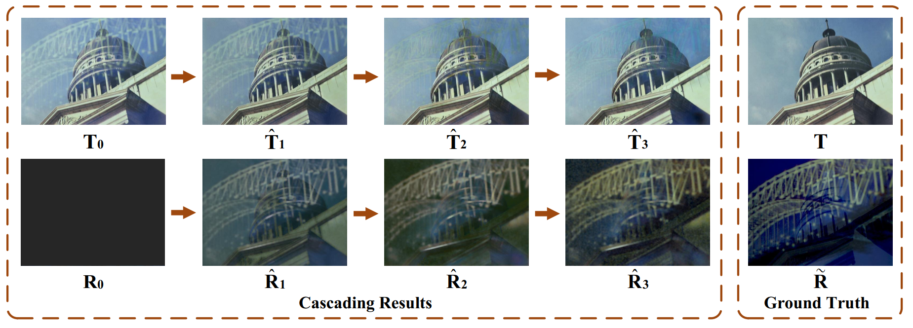

# Single Image Reflection Removal through Cascaded Refinement  

We provide code and our dataset for the Paper:

**[Single Image Reflection Removal through Cascaded Refinement  ][1]**\
Chao Li, Yixiao Yang, Kun He, Stephen Lin, John E. Hopcroft\
[CVPR 2020]




## Introduction

For single-image reflection removal (SIRR), researchers have observed that some handcrafted priors may help for distinguishing the transmission layer from the reflection layer in a single image. But these priors often do not generalize well to different types of reflections and scenes owing to disparate imaging conditions. In recent years, researchers apply data-driven learning to replace handcrafted priors via deep convolutional neural networks. With abundant labeled data, a network can be trained to perform effectively over a broad range of scenes. However, learning-based single image methods still have much room for improvement due to complications such as limited training data, disparate
imaging conditions, varying scene content, limited physical understanding of this problem, and the performance limitation of various models.

In this work, inspired by the iterative structure reduction approach for hidden community detection in social networks, we introduce a cascaded neural network model for transmission and reflection decomposition. To the best of our knowledge, previous works on reflection removal did not utilize a cascaded refinement approach.  

For a cascade model on SIRR, a simple approach is to employ one network to generate a predicted transmission that serves as the auxiliary information of the next network, and continue such process with subsequent networks to iteratively improve the prediction quality. With a long cascade, however, the training becomes difficult due to the  vanishing gradient problem and limited training guidance at each step. To address this issue, we design a convolutional LSTM (Long Short-Term Memory) network, which saves information from the previous iteration (i.e. time step) and allows gradients to flow unchanged.  

Our main contributions are as follows:

1) We propose a new network architecture, a cascaded network, with loss components that achieves state-of-the-art quantitative results on real-world benchmarks for the single image reflection removal problem. 

2) We design a residual reconstruction loss, which can form a closed loop with the linear method for synthesizing images with reflections, to expand the influence of the synthesis method across the whole network.  

3) We collect a new real-world dataset containing images with densely-labeled ground-truth, which can serve as baseline data in future research. 


## Requisites

* PyTorch
  Use the instructions that are outlined on [PyTorch Homepage][2] for installing PyTorch for your operating system
* Python 3
* Linux
* CPU or NVIDIA GPU + CUDA CuDNN


## Quick Start

### Prepare Datasets

Download and unzip our created [dataset](https://drive.google.com/file/d/1YWkm80jWsjX6XwLTHOsa8zK3pSRalyCg/view?usp=sharing ) and images from [Zhang et al.][3], and then copy them to ```datasets/reflection```.


### Test

- #### Download Pre-trained Model

Download and unzip our [pre-trained model](https://drive.google.com/file/d/1Dnlb875jP-F3vcFHlolcPTXFn4RmnQNr/view?usp=sharing), and then copy them to ```checkpoints/IBCLN```.

- #### Prepare data

Copy image pairs ```T``` and ```I``` you want to test to ```datasets/reflection/testA1``` and ```datasets/reflection/testB``` separately.
If ```T``` image is not given, the ground truth will be an all black image.

- #### Run

You can run ```bash test.sh```

or equivalently:

```python test.py --dataroot datasets/reflection --name IBCLN --model IBCLN --dataset_mode resize_natural_3  --preprocess "" --no_flip --epoch final --gpu_ids 0```	


### Train

- #### Prepare data

Make two directories ```trainA1, trainA2``` in ```datasets/reflection``` i.e.

```
cd datasets/reflection
mkdir trainA1
mkdir trainA2
```

Prepare some images for synthesis. Copy ```T``` and ```R``` images to ```trainA1``` and ```trainA2``` separately.

- #### Run

You can run ```bash train.sh```

or equivalently:

```python train.py --dataroot datasets/reflection --name IBCLN --model IBCLN --dataset_mode resize_natural_3   --no_flip   --gpu_id 0 --display_id -1```


## Description of the files in this repository

1) ``train.py``: Execute this file to train the model 
2) ``test.py``: Execute this file to test the model 
3) ``model/IBCLN_model.py``: Contains the class defining our model
4) ``model/networks.py``: Contains the function that defining the networks and losses.
5) ``options/base_options.py``: This file contains the basic options
6) ``options/train_options.py``: This file contains the options for training
7) ``options/test_options.py``: This file contains the options for testing


## Acknowledgement

Our code architecture  is inspired by [pytorch-CycleGAN-and-pix2pix](https://github.com/junyanz/pytorch-CycleGAN-and-pix2pix).


## Citation

If you find this code and data useful, please consider citing the original work by authors:

```
@article{li2019single,
  title={Single Image Reflection Removal through Cascaded Refinement},
  author={Li, Chao and Yang, Yixiao and He, Kun and Lin, Stephen and Hopcroft, John E},
  journal={arXiv preprint arXiv:1911.06634},
  year={2019}
}
```


[1]: https://arxiv.org/pdf/1911.06634.pdf
[2]: http://pytorch.org/docs/master
[3]: https://drive.google.com/drive/folders/1NYGL3wQ2pRkwfLMcV2zxXDV8JRSoVxwA
[4]: http://rose1.ntu.edu.sg/Datasets/sir2Benchmark.asp
[5]: https://drive.google.com/file/d/1YWkm80jWsjX6XwLTHOsa8zK3pSRalyCg/view?usp=sharing